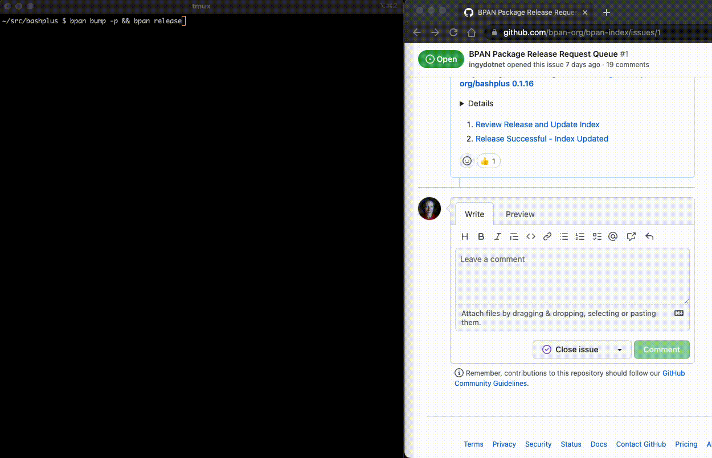

bpan-index
==========

The [BPAN](https://github.com/bpan-org/bpan#readme) Package Index

## Synopsis

This video shows how a BPAN release is done from the command line.
The (`bashplus` package) author runs:

* `bpan bump` - Prepare the next version release
* `bapn release` - Submit the new release to the index updater
* A comment is posted to https://github.com/bpan-org/bpan-index/issues/1
* That triggers a GitHub Actions workflow to:
  * Verify the release is ready
  * If ready, update the BPAN index
  * Notify the author of success or failure
* This actual release is logged here:
  * https://github.com/bpan-org/bpan-index/issues/1#issuecomment-1257059529

## Description

This repo contains the index file that BPAN uses to find its packages.

## Package Registration

If you have a Bash package that you want to publish to BPAN, just add an entry
for it to the `index.ini` file and submit a pull request.

The index file is regenerated periodically by scanning all registered packages
for new tagged commits that pass all the BPAN release checks.

## Copyright and License

Copyright 2022 by Ingy döt Net

This is free software, licensed under:

The MIT (X11) License
